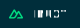

<h1>Hello👋, I am Santo.</h1>

Fullstack Web Developer

<h3>Welcome to my profile. I'm a full-stack web application developer. I love to build complex UI. Coding is my intoxication. I'm a good seller on <a
        href="https://www.fiverr.com/web__architect?up_rollout=true" title="fiverr">Fiverr</a>.</h3>

<h3>Skills</h3>

<table>
    <thead>
        <tr>
            <td colspan="3"><strong>Markup Languages</strong></td>
        </tr>
    </thead>
    <thead>
        <tr>
            <td>
                
            </td>
        </tr>
    </thead>
</table>

<table>
    <thead>
        <tr>
            <td colspan="6"><strong>CSS</strong></td>
        </tr>
    </thead>
    <tbody>
        <tr>
            <td>
                
                
                
            </td>
        </tr>
    </tbody>
</table>

<table>
    <thead>
        <tr>
            <td colspan="3"><strong>Programming Languages</strong></td>
        </tr>
    </thead>
    <tbody>
        <tr>
            <td>
                
                
                
            </td>
        </tr>
    </tbody>
</table>

<table>
    <thead>
        <tr>
            <td colspan="5"><strong>Frontend Frameworks</strong></td>
        </tr>
    </thead>
    <tbody>
        <tr>
            <td>
                
                
                
                
            </td>
        </tr>
    </tbody>
</table>

<table>
    <thead>
        <tr>
            <td colspan="5"><strong>Backend Frameworks</strong></td>
        </tr>
    </thead>
    <tbody>
        <tr>
            <td>
                
                
                
                
            </td>
        </tr>
    </tbody>
</table>

<table>
    <thead>
        <tr>
            <td colspan="3"><strong>Databases</strong></td>
        </tr>
    </thead>
    <tbody>
        <tr>
            <td>
                
                
                
                
            </td>
        </tr>
    </tbody>
</table>

<table>
    <thead>
        <tr>
            <td colspan="3"><strong>Other Technologies</strong></td>
        </tr>
    </thead>
    <tbody>
        <tr>
            <td>
                
                
                
                
                
                
                
                
                
                
                
                
                
                
                
                
            </td>
        </tr>
    </tbody>
</table>

Love to work on  based server

<table>
    <tr>
        <td> Work Profiles</td>
        <td>
            
        </td>
        <td>
            
        </td>
    </tr>
</table>

<table>
    <tbody>
        <tr>
            <td>Social Links</td>
            <td>
                
            </td>
            <td>
                
            </td>
            <td>
                
            </td>
            <td>
                
            </td>
        </tr>
    </tbody>
</table>

Thank you Santo

